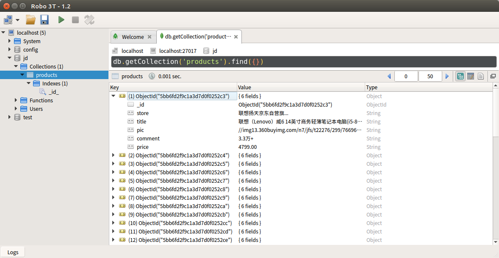
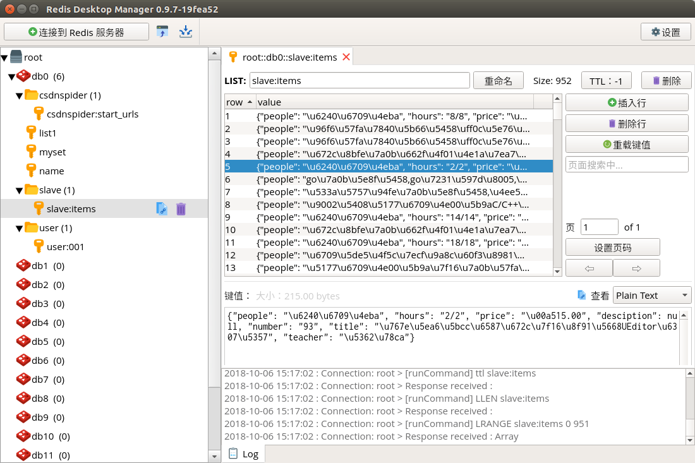

# 第10周作业说明

### 作业1

项目中连接的 MongoDB 数据库名称为 **jd**，集合名称为 **products**。

运行爬虫程序前需要确保数据库和集合已经创建，比如在mongo命令行客户端中执行：

```
> use jd
> db.createCollection("products")
```

另外，Selenium 使用的 WebDriver 是 phantomjs。

默认爬取5页数据，请在 settings.py 中设置：

```python
# 爬取的页数
MAX_PAGE = 5
```

执行爬虫：

```
$ scrapy crawl laptop
```

查看 MongoDB 数据库




---

### 作业2

先执行 csdnMaster 爬虫，再执行 csdnSlave





