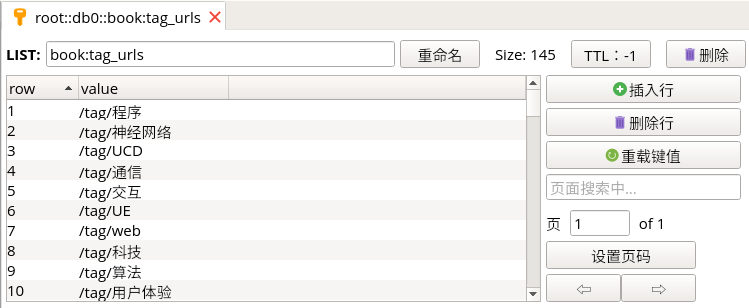
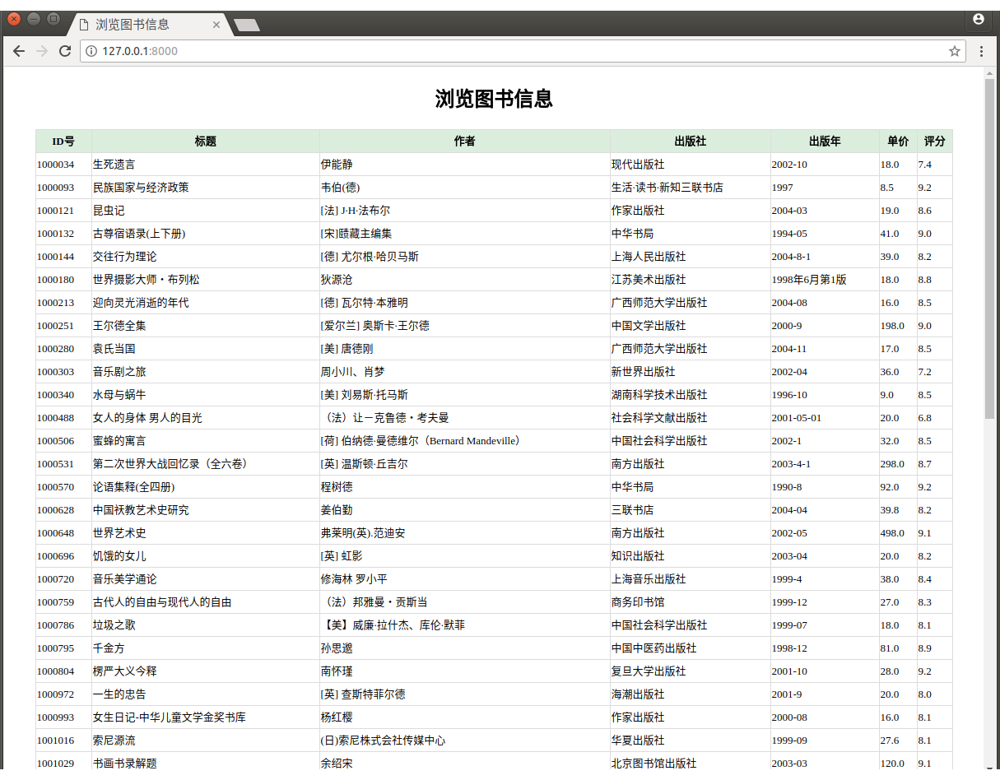

# 第11周作业说明

**MySQL**： `doubandb` 数据库中的 `books` 数据表

```mysql
CREATE TABLE `books` (                                            
  `id` bigint(20) unsigned NOT NULL COMMENT 'ID号',              
  `title` varchar(255) DEFAULT NULL COMMENT '书名',             
  `author` varchar(64) DEFAULT NULL COMMENT '作者',             
  `press` varchar(255) DEFAULT NULL COMMENT '出版社',          
  `original` varchar(255) DEFAULT NULL COMMENT '原作名',       
  `translator` varchar(128) DEFAULT NULL COMMENT '译者',        
  `imprint` varchar(128) DEFAULT NULL COMMENT '出版年',        
  `pages` int(10) unsigned DEFAULT NULL COMMENT '页数',         
  `price` double(6,2) unsigned DEFAULT NULL COMMENT '定价',     
  `binding` varchar(32) DEFAULT NULL COMMENT '装帧',            
  `series` varchar(128) DEFAULT NULL COMMENT '丛书',            
  `isbn` varchar(128) DEFAULT NULL COMMENT 'ISBN',                
  `score` varchar(128) DEFAULT NULL COMMENT '评分',             
  `number` int(10) unsigned DEFAULT NULL COMMENT '评论人数',  
  PRIMARY KEY (`id`)                                              
) ENGINE=InnoDB DEFAULT CHARSET=utf8
```


---


**模块1** 

- 运行

  ```
  $ python3 load_tag_url.py 
  status:200
  共计写入tag：145个
  ```

- 爬取豆瓣读书145个标签，Redis 键名为 `book:tag_urls`




**模块2** 整理所有图书的 URL 地址，Redis 键名为 `books:id` 和 `bookspider:start_urls`


> 如果采用代理等反爬措施，很可能会出现封 IP 提示：==检测到有异常请求从你的 IP 发出，请 [登录](https://www.douban.com/accounts/login?redir=https%3A%2F%2Fbook.douban.com%2Fsubject%2F26202093%2F) 使用豆瓣。==


**模块3** 爬取所有图书详情页，Redis 键名为 `slave_book:items`


**模块4** 将 Redis 数据写入 MySQL 的 `doubandb` 数据库的 `books` 数据表


**web 数据展示**

```
$ python3 manage.py runserver
```





---


**MySQL 数据表的导入与导出**

- 导入：`mysql -u root -p doubandb < douban.sql`
- 导出：`mysqldump -u root -p doubandb > douban.sql`

