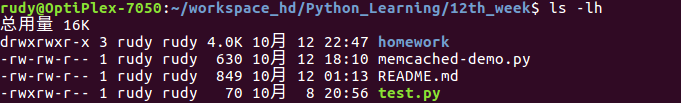
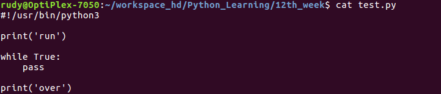
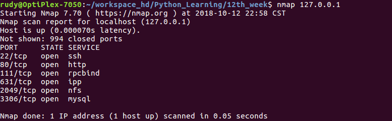
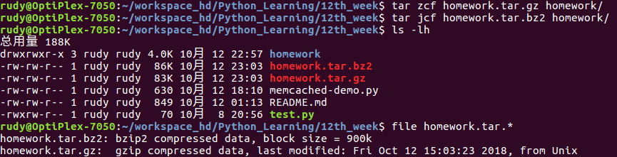
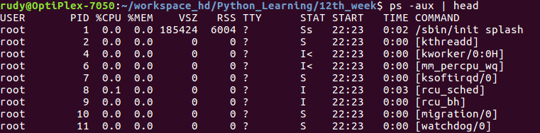
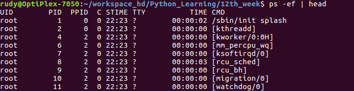
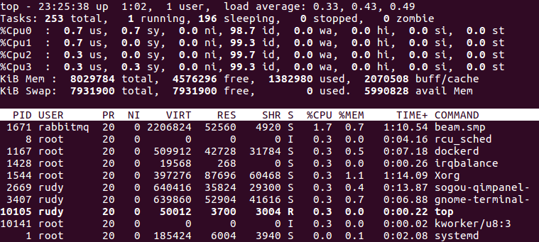
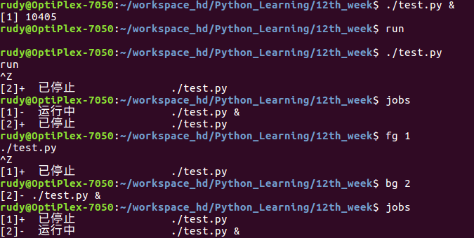

# Linux 常用操作

### ① 文件管理

- `ls` ：list，列出目录内容

  

- `pwd` ：print working directory，打印当前工作目录

- `touch` ：创建文件

- `rm` ：remove，删除文件

- `cp` ：copy，复制

- `mv` ：move，移动

- `find` ：查找

- `cat` , `more`：查看内容

  

- `ln` ：link，链接


---

### ② 软件安装

#### 二进制软件包管理

Ubuntu

- 更新软件仓库信息：`apt update`
- 安装 zip 软件：`apt install -y zip`
- 卸载 zip 软件：`apt remove zip`

CentOS

- 更新软件仓库信息：`yum update`
- 安装 zip 软件：`yum install -y zip`
- 卸载 zip 软件：`yum remove zip`


#### 源码编译准备工作

Ubuntu

```
$ sudo apt install -y gcc  g++  make
```

CentOS

```
$ sudo yum install -y gcc  gcc-c++  make
```


源码下载

```
$ wget https://example.com/xxx.tar.gz
```

源码编译基本步骤

- 解压缩软件包，阅读安装说明 README、INSTALL 等文件
- `./configure --prefix=/usr/local/path`
- `make`
- `make install`


示例：编译安装 nmap

https://nmap.org/download.html

```
$ wget https://nmap.org/dist/nmap-7.70.tar.bz2
$ tar jxvf nmap-7.70.tar.bz2
$ cd nmap-7.70/
```

阅读 README.md

```
./configure
make
make install
```


配置 `./configure --prefix=/usr/local/nmap`

```
config.status: creating config.h
            .       .
            \`-"'"-'/
             } 6 6 {
            ==. Y ,==
              /^^^\  .
             /     \  )  Ncat: A modern interpretation of classic Netcat
            (  )-(  )/
            -""---""---   /
           /   Ncat    \_/
          (     ____
           \_.=|____E
Configuration complete.

                    ___.-------.___
                _.-' ___.--;--.___ `-._
             .-' _.-'  /  .+.  \  `-._ `-.
           .' .-'      |-|-o-|-|      `-. `.
          (_ <O__      \  `+'  /      __O> _)
            `--._``-..__`._|_.'__..-''_.--'
                  ``--._________.--''
   ____  _____  ____    ____       _       _______
  |_   \|_   _||_   \  /   _|     / \     |_   __ \
    |   \ | |    |   \/   |      / _ \      | |__) |
    | |\ \| |    | |\  /| |     / ___ \     |  ___/
   _| |_\   |_  _| |_\/_| |_  _/ /   \ \_  _| |_
  |_____|\____||_____||_____||____| |____||_____|

  NMAP IS A POWERFUL TOOL -- USE CAREFULLY AND RESPONSIBLY
Configured with: ndiff zenmap nping openssl zlib libssh2 lua ncat
Configured without: localdirs nmap-update
Type make (or gmake on some *BSD machines) to compile.
```

配置完之后执行 `make` 和 `make install` ，接下来就可以测试啦




> 注意：有时候编译源码的时候，会依赖一些软件包，那么就需要提前安装好所需的依赖。


---

### ③ 打包解压

#### tar命令

- gzip 格式
  - 压缩：`tar zcvf xxx.tar.gz xxx/`
  - 解压：`tar zxvf xxx.tar.gz`
- bzip2 格式
  - 压缩：`tar jcvf xxx.tar.bz2 xxx/`
  - 解压：`tar jxvf xxx.tar.bz2`



另外，对于 zip 格式，需要安装 zip 工具

- 安装：`sudo apt-get install zip`

- 压缩：`zip -r xxx.zip xxx`
- 解压：`unzip xxx.zip`


---

### ④ 用户和权限管理

#### Linux 文件权限

| 代表字符 | 权限                | 对文件的含义     | 对目录的含义               |
| -------- | ------------------- | ---------------- | -------------------------- |
| `r`      | 读权限（Read）      | 可以查看文件内容 | 可以列出目录中的内容       |
| `w`      | 写权限（Write）     | 可以修改文件内容 | 可以在目录中创建、删除文件 |
| `x`      | 执行权限（eXecute） | 可以执行文件     | 可以进入目录               |


#### Linux 用户和用户组

- **u**ser (owner) 所有者
  - `useradd` 添加用户，`-g` 指定用户组，`-m` 创建家目录（CentOS 默认创建）
  - `userdel` 删除用户，`-r` 连同家目录一起删除
  - `passwd` 修改用户密码
- **g**roup 所属组
  - `groupadd` 添加用户组
  - `groupdel` 删除用户组
- **o**ther 其他人
- **a**ll 所有


#### 修改权限

- `chown` ：修改所属用户
- `chgrp` ：修改所属组
- `chmod` ：修改文件权限


---

### ⑤ 进程管理

#### ps 命令 —— 查看进程

- BSD 风格

  

- System V 风格

  

#### top 命令 —— 任务监视



#### kill 命令 —— 杀死进程

```
kill    887
kill -9 887
pkill   test
killall test
```

#### 前后台运行调用

- 在命令末尾加上 `&` 符号，就可以让程序在后台运行
- 程序正在前台运行，可以使用 `Ctrl + Z` 把程序暂停，`Ctrl + C` 终止程序
- `jobs` 查看当前终端（tty）运行的程序
- `bg` 把暂停的程序放到后台运行
- `fg` 把一个程序调到前台运行


