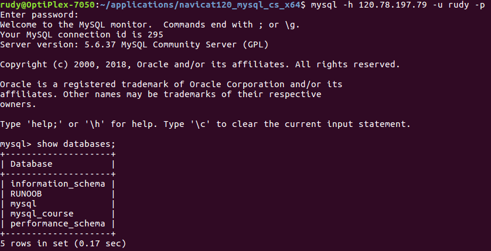
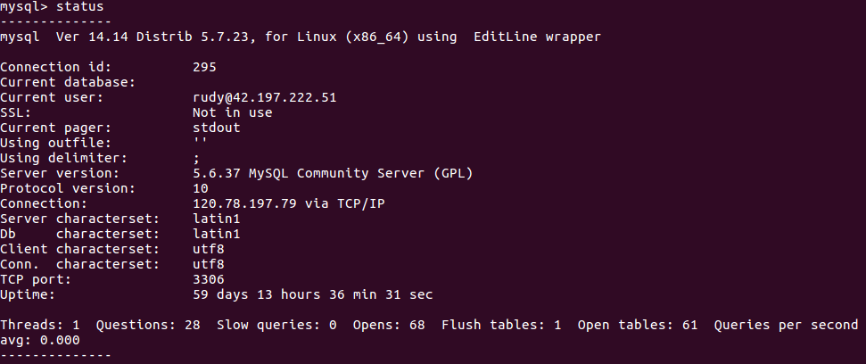

# 服务器软件安装与管理

### ① MySQL

#### 安装 MySQL 服务端和客户端

```
# apt update
# apt install -y mysql-server mysql-client
```

服务的启停

```
# service mysql stop
# service mysql start
# service mysql restart
```

配置文件

```
# vi /etc/mysql/my.cnf
```

#### 命令行登录

```
$ mysql -u root -p
```

#### 用户管理

授权（以便于远程登录）

```mysql
mysql> grant all on *.* to root@"%" identified by "123456"
```

查看用户

```mysql
mysql> select host,user from mysql.user;
+-----------+------------------+
| host      | user             |
+-----------+------------------+
| %         | rudy             |
| localhost | debian-sys-maint |
| localhost | mysql.session    |
| localhost | mysql.sys        |
| localhost | phpmyadmin       |
| localhost | root             |
+-----------+------------------+
6 rows in set (0.01 sec)
```


#### 连接远程数据库



status 命令查看状态



更多状态、配置信息

```mysql
mysql> show variables like 'max_connections';
+-----------------+-------+
| Variable_name   | Value |
+-----------------+-------+
| max_connections | 151   |
+-----------------+-------+
1 row in set (0.22 sec)

mysql> show global status like 'max_used_connections';
+----------------------+-------+
| Variable_name        | Value |
+----------------------+-------+
| Max_used_connections | 4     |
+----------------------+-------+
1 row in set (0.00 sec)

mysql> show variables like 'innodb_buffer_pool_size';
+-------------------------+-----------+
| Variable_name           | Value     |
+-------------------------+-----------+
| innodb_buffer_pool_size | 134217728 |
+-------------------------+-----------+
1 row in set (0.01 sec)

mysql> show status like 'innodb_rows_%';
+----------------------+-------+
| Variable_name        | Value |
+----------------------+-------+
| Innodb_rows_deleted  | 0     |
| Innodb_rows_inserted | 0     |
| Innodb_rows_read     | 0     |
| Innodb_rows_updated  | 0     |
+----------------------+-------+
4 rows in set (0.02 sec)
```


> 手册 <https://dev.mysql.com/doc/refman/5.7/en/>