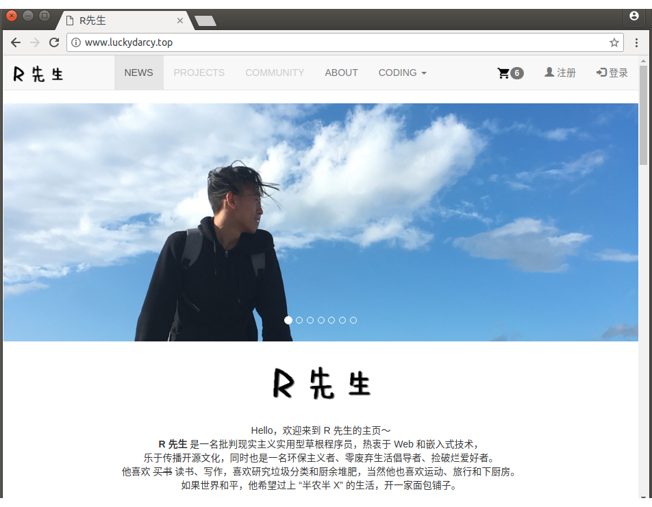

# 部署 Django 项目

### 安装 uWSGI

```
$ sudo pip3 install uwsgi
```

前台运行

```
uwsgi --http :80 --chdir /root/demo --module demo.wsgi
```

后台运行

```
uwsgi --http :80 --chdir /root/demo --module demo.wsgi --daemonize /var/log/uwsgi.log
```


#### 个人网页

URL 地址：<http://www.luckydarcy.top/>

或者直接输入 IP 地址：<http://120.78.197.79/>

