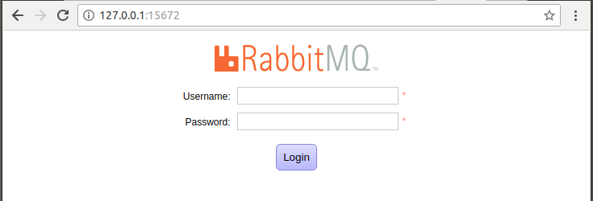

# 高并发架构

### 高可用与高并发架构介绍


什么是高可用？

- High Availability（HA）
- 保证系统 7*24 小时正常服务


为了保证高可用，其核心准则是**冗余**！


设计高可用系统原则

- 异地双活（多）
- 双机热备（多）
- 灰度发布与回滚
- 限流
- 降级


什么是高并发？

- High Concurrency
- 单位时间内，为更多的人提供服务


为了保证高并发，其核心准则是**扩展**！包括垂直扩展和水平扩展（水平扩展是终极方案）。


设计高并发系统原则

- 无状态设计
- 服务拆分（微服务架构）
- 缓存（减少对后端数据库的请求）
- 队列


------

### 反向代理与负载均衡


学习目标：

1. 了解反向代理与负载均衡技术
2. 熟悉 Nginx 安装与配置
3. 了解 Nginx 反向代理与负载均衡


#### Nginx 安装与管理

```shell
# 安装Nginx
$ sudo apt update
$ sudo apt install -y nginx
$ nginx -V

# 服务的启停
$ service nginx start
$ service nginx stop
$ service nginx restart

# 测试配置项
$ nginx -t
# 重新加载配置项
$ nginx -s reload
```


Nginx 主配置文件

```
/etc/nginx/nginx.conf
```


------

### 缓存

缓存算法

1. **LRU**（Least Recently Used）最近最少使用
2. **LFU**（Least Frequently Used）根据数据的历史访问频率来淘汰数据


#### Memcached

Memcached 是高性能的分布式内存缓存系统，一般用来缓存访问的热点数据，以减轻数据库负担。


#### 安装

```
$ sudo apt-get install memcached

$ service memcached start
$ service memcached stop
$ service memcached restart
```


#### 参数配置

/etc/memcached.conf

```
-d 守护进程
-m 内存，缺省为64MB
-u 运行用户
-l 监听的服务器IP地址
-p 监听端口，缺省为11211
-c 并发连接数，缺省为1024
```


#### 连接测试

```shell
$ telnet 127.0.0.1 11211
Trying 127.0.0.1...
Connected to 127.0.0.1.
Escape character is '^]'.

version
VERSION 1.4.25 Ubuntu

stats
STAT pid 25265					# 进程ID
STAT uptime 234					# 运行时间（单位秒）
STAT time 1539327303			#
STAT version 1.4.25 Ubuntu		# 版本
STAT libevent 2.0.21-stable		# libevent版本
STAT pointer_size 64			# 系统指针（32bit/64bit）
STAT rusage_user 0.003390		# 
STAT rusage_system 0.010141		#
STAT curr_connections 1			# 当前打开的连接数
STAT total_connections 2		# 实例启动后打开的连接总数
STAT connection_structures 2	#
STAT reserved_fds 20			#
STAT cmd_get 0					# get命令总请求次数
STAT cmd_set 0					# set命令总请求次数
STAT cmd_flush 0				#
STAT cmd_touch 0				#
STAT get_hits 0					# 总命中次数
STAT get_misses 0				# 总未命中次数
STAT delete_misses 0			#
STAT delete_hits 0				#
STAT incr_misses 0				#
STAT incr_hits 0				#
STAT decr_misses 0				#
STAT decr_hits 0				#
STAT cas_misses 0				#
STAT cas_hits 0					#
STAT cas_badval 0				#
STAT touch_hits 0				#
STAT touch_misses 0				#
STAT auth_cmds 0				#
STAT auth_errors 0				#
STAT bytes_read 16				# 总读取字节数（请求字节数）
STAT bytes_written 23			# 总发送字节数（结果字节数）
STAT limit_maxbytes 67108864	# 分配的缓存大小
STAT accepting_conns 1			#
STAT listen_disabled_num 0		#
STAT time_in_listen_disabled_us 0
STAT threads 4					# 当前线程数
STAT conn_yields 0				#
STAT hash_power_level 16		#
STAT hash_bytes 524288			#
STAT hash_is_expanding 0		#
STAT malloc_fails 0				#
STAT bytes 0					# 实例存储items占用的字节数
STAT curr_items 0				# 当前实例存储的items数量
STAT total_items 0				# 实例启动后存储的items总数量
STAT expired_unfetched 0		#
STAT evicted_unfetched 0		#
STAT evictions 0				# 为获取空闲内存而删除的items数
STAT reclaimed 0				#
STAT crawler_reclaimed 0		#
STAT crawler_items_checked 0	#
STAT lrutail_reflocked 0		#
END

quit
Connection closed by foreign host.
```


#### 在 Python 中使用 memcached

```shell
$ sudo pip3 install python-memcached

$ pip3 freeze | grep memcached
python-memcached==1.59
```


**基本使用**

```python
import memcache

# 连接memcached
mc = memcache.Client(['127.0.0.1:11211'])
# 存入，并设置过期时间
mc.set('name','python',10)
# 读取
mc.get('name')
# 删除
mc.delete('name')
```


**示例代码**

```python
"""
  文件：memcached-demo.py 
"""

import pymysql
import memcache


def get_data():
    """ Memcache + MySQL 获取数据 """

    mc = memcache.Client(['127.0.0.1:11211'])

    cachekey = 'product_list'
    res = mc.get(cachekey)
    if res is not None:
        return res

    print('正在查询数据库...')

    conn = pymysql.connect(host='localhost', user='root', password='lu1010', db='doubandb', charset='utf8')
    cursor = conn.cursor()
    sql = 'select * from books limit 3'
    cursor.execute(sql)
    data = cursor.fetchall()
    cursor.close()
    conn.close()

    # 有效时间60秒
    mc.set(cachekey, data, 60)

    return data

print(get_data())
```

**执行效果**

- 第1次

  ```shell
  $ python3 memcached-demo.py 
  正在查询数据库...
  ((1000034, '生死遗言', '\n            伊能静', '现代出版社', '', '', '2002-10', 203, 18.0, '平装', '', '9787800288494', '7.4', 2380), (1000093, '民族国家与经济政策', '韦伯(德)', '生活·读书·新知三联书店', '', '\n            甘阳', '1997', 141, 8.5, '平装', '社会与思想丛书', '9787108010964', '9.2', 188), (1000121, '昆虫记', '\n                [法]\n            J·H·法布尔', '作家出版社', '', '王光', '2004-03', 352, 19.0, '平装', '', '9787506312820', '8.6', 4574))
  ```

- 第2次

  ```shell
  $ python3 memcached-demo.py 
  ((1000034, '生死遗言', '\n            伊能静', '现代出版社', '', '', '2002-10', 203, 18.0, '平装', '', '9787800288494', '7.4', 2380), (1000093, '民族国家与经济政策', '韦伯(德)', '生活·读书·新知三联书店', '', '\n            甘阳', '1997', 141, 8.5, '平装', '社会与思想丛书', '9787108010964', '9.2', 188), (1000121, '昆虫记', '\n                [法]\n            J·H·法布尔', '作家出版社', '', '王光', '2004-03', 352, 19.0, '平装', '', '9787506312820', '8.6', 4574))
  ```

  

------

### 异步化

学习目标

1. 理解同步与异步
2. 安装 RabbitMQ 消息队列
3. 在 Python 中使用 RabbitMQ


MQ（消息队列，Message Queue）

常用消息队列软件

- ActiveMQ
- RabbitMQ（淘宝也在用）
- Kafka
- Redis


#### RabbitMQ 基本概念

**AMQP**（高级消息队列协议，Advanced Message Queuing Protocol）是一个提供统一消息服务的应用层标准高级消息队列协议，是应用层协议的一个开放标准，为面向消息的中间件设计。基于此协议的客户端与消息中间件可传递消息，并不受客户端/中间件不同产品、不同的开发语言等条件的限制

RabbitMQ 是一个消息代理，它的工作就是接收和转发消息。你可以把它想象成一个邮局：你把信件放入邮箱，邮递员就会把信件投递到你的收件人处。在这里，RabbitMQ 就扮演这邮箱、邮局以及邮递员的角色。

- 生产者 Producer 创建消息，然后发布到代理服务器（RabbitMQ）；
- 消费者 Consumer 连上代理服务器，订阅监听消息；
- 信道 Channel 连接上服务器之后，需要建立通讯信道（一个连接上可以建立多条信道）；
- 队列 Queue 是个巨大的消息缓冲区，多个生产者可以把消息发送给同一个队列，同样多个消费者也能够从同一个队列中获取数据；
- 交换机 Exchange 生产者不能直接将消息发到队列中，而是将消息发送到交换机上，根据路由键（routing key）和交换机类型，决定投递到哪个队列，交换机有4种类型：
  - `direct`：关键字类型，根据消息中不同的关键字将消息发送给不同的队列
  - `fanout`：广播
  - `topic`：模糊匹配类型
  - `header`：与其他3中不同，允许匹配 AMQP 消息的 header 而不是路由键（不常用）


消息队列的使用过程如下：

1. 客户端连接到消息队列服务器，打开一个 channel；
2. 客户端声明一个 exchange，并设置相关属性；
3. 客户端声明一个 queue，并设置相关属性；
4. 客户端使用 routing key，在 exchange 和 queue 之间建立好绑定关系；
5. 客户端投递消息到 exchange；
6. Exchange 接收到消息后，就根据消息的 key 和已经设置的 binding，进行消息路由，将消息投递到一个或多个队列里。


#### RabbitMQ 安装与管理

```
$ sudo apt-get install rabbitmq-server

$ service rabbitmq-server start
$ service rabbitmq-server stop
$ service rabbitmq-server restart
```

启动管理工具

```
$ sudo rabbitmq-plugins enable rabbitmq_management

The following plugins have been enabled:
  mochiweb
  webmachine
  rabbitmq_web_dispatch
  amqp_client
  rabbitmq_management_agent
  rabbitmq_management

Applying plugin configuration to rabbit@OptiPlex-7050... started 6 plugins.
```

浏览器访问 `http://127.0.0.1:15672`



添加用户 rudy

```
$ sudo rabbitmqctl add_user rudy 111111
Creating user "rudy" ...
```

此时还不能登录，因为 RabbitMQ 有比较复杂的权限控制，执行以下命令将 rudy 设置为管理员角色

```
$ sudo rabbitmqctl set_user_tags rudy administrator
Setting tags for user "rudy" to [administrator] ...
```


#### 在 Python 中使用 RabbitMQ

**pika**

```
$ sudo pip3 install pika
```

**celery**

```
$ sudo pip3 install celery
```

