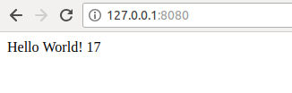

# 示例2

#### 准备 Redis

- 拉取 Redis 镜像

  ```
  docker pull redis:alpine
  ```

- 启动 Redis 服务，挂载目录并指定容器名称

  ```
  docker run -d --name redis -v $(pwd)/redis-data:/data redis:alpine
  ```

- 查看详情，了解其暴露的 TCP 端口是 6379

  ```
  docker inspect redis:alpine
  ```


---

#### 构建 myweb 镜像

- 编写 app.py

- 编写 Dockerfile 

- 执行构建 

  ```
  docker build -t myweb .
  ```


---

#### 运行

容器的 5000 端口映射到主机的 8080 端口，同时连接 Redis，并以服务的方式启动 myweb：

```
docker run --rm -d --link redis -p 8080:5000 myweb
```

浏览器访问 <http://127.0.0.1:8080/> ，每刷新一次数字加1




此时，在主机的 redis-data 目录中保存了一个 dump.rdb 文件。


---

#### 试验

- 停止并删除 Redis 容器

  ```
  docker stop redis
  docker rm redis
  ```

- 重启 Redis 容器

  ```
  docker run -d --name redis -v $(pwd)/redis-data:/data redis:alpine
  ```

