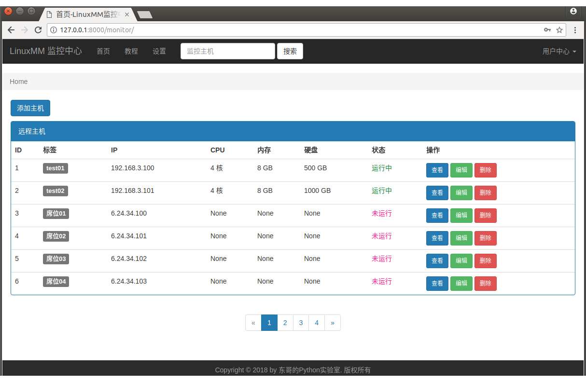
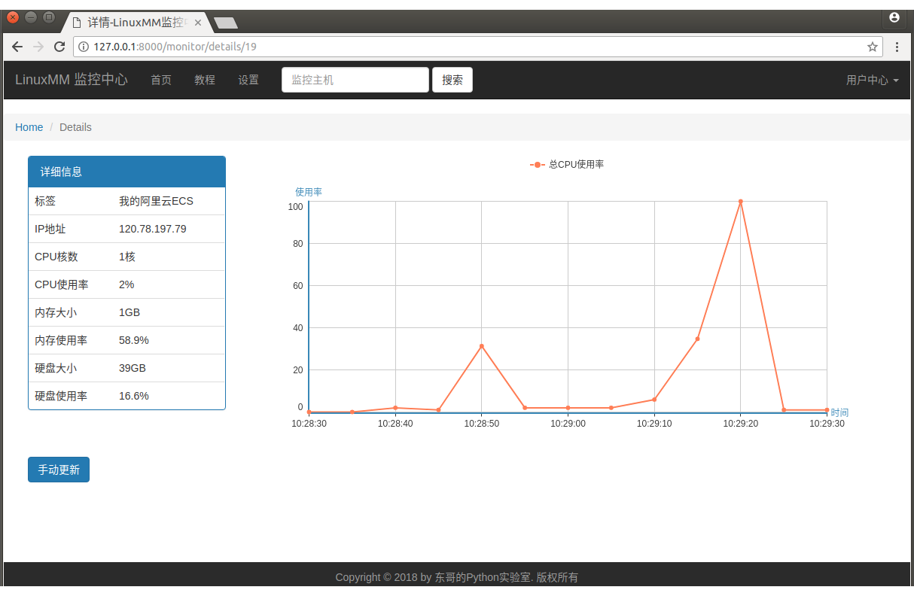
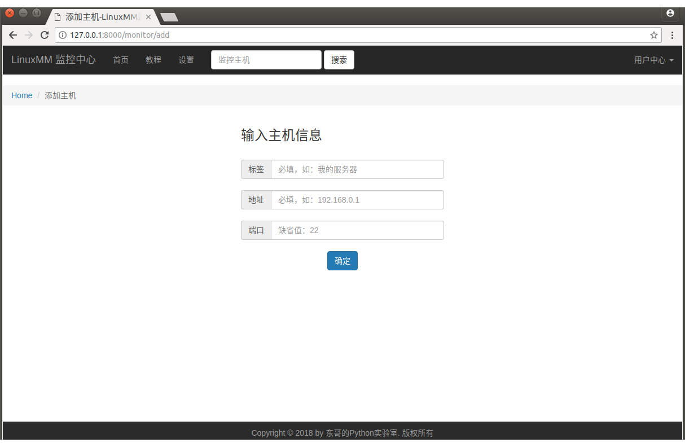
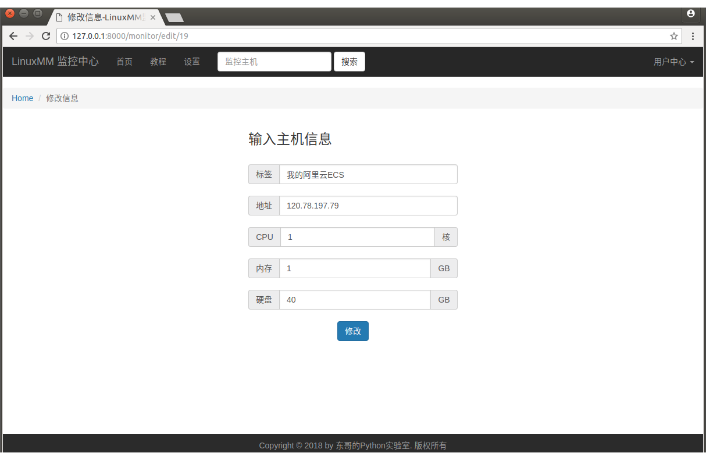
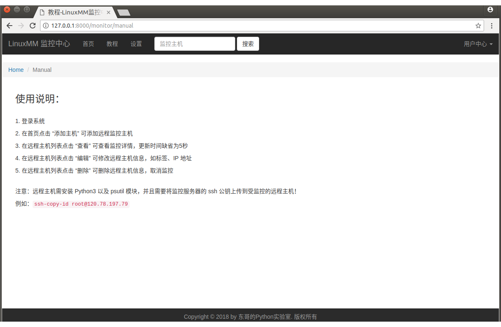
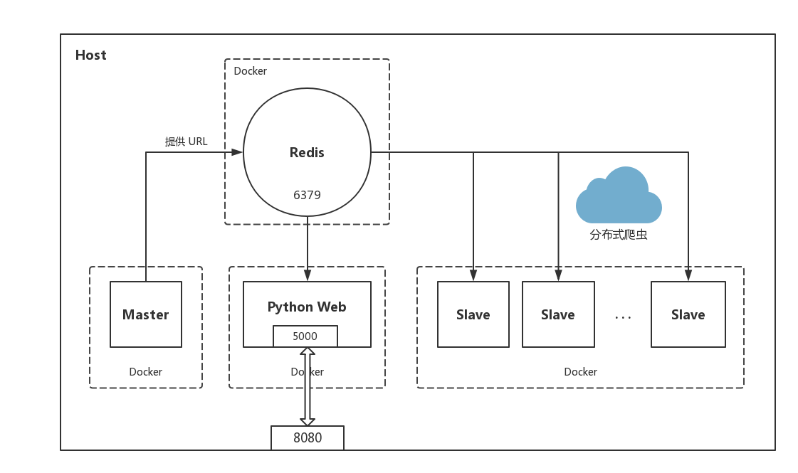
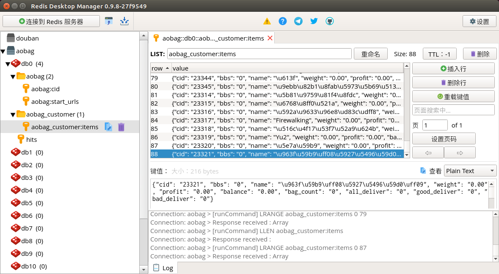

# 第13周作业说明

### 作业一、Linux监控中心

工程目录 **linuxmm**（Linux Monitor Mall）

```
$ django-admin startproject linuxmm
$ cd linuxmm/
$ python3 manage.py startapp monitor
```

启动服务

```
$ python3 manage.py ruerver
```

服务启动后，在浏览器输入 URL `http://127.0.0.1:8000/monitor/`

注意：运行 LinuxMM 项目前，请导入 **linuxmm.sql** 数据库文件！ 

【host】数据表结构

```
+-------+----------------------+------+-----+---------+----------------+
| Field | Type                 | Null | Key | Default | Extra          |
+-------+----------------------+------+-----+---------+----------------+
| id    | int(10) unsigned     | NO   | PRI | NULL    | auto_increment |
| tag   | varchar(32)          | NO   |     | NULL    |                |
| ip    | varchar(32)          | NO   |     | NULL    |                |
| cpu   | smallint(5) unsigned | YES  |     | NULL    |                |
| mem   | bigint(20) unsigned  | YES  |     | NULL    |                |
| disk  | bigint(20) unsigned  | YES  |     | NULL    |                |
| stat  | tinyint(3) unsigned  | YES  |     | 0       |                |
| cdate | datetime             | YES  |     | NULL    |                |
+-------+----------------------+------+-----+---------+----------------+
```

【user】数据表结构

```
+----------+------------------+------+-----+---------+----------------+
| Field    | Type             | Null | Key | Default | Extra          |
+----------+------------------+------+-----+---------+----------------+
| id       | int(10) unsigned | NO   | PRI | NULL    | auto_increment |
| username | varchar(32)      | NO   |     | NULL    |                |
| password | varchar(32)      | NO   |     | NULL    |                |
| email    | varchar(32)      | NO   |     | NULL    |                |
| cdate    | datetime         | YES  |     | NULL    |                |
+----------+------------------+------+-----+---------+----------------+
```

登录功能测试用户名为 admin，密码为 20181024


---

### 使用说明

1. 登录系统
2. 在首页点击 “添加主机” 可添加远程监控主机
3. 在远程主机列表点击 “查看” 可查看监控详情，更新时间缺省为5秒
4. 在远程主机列表点击 “编辑” 可修改远程主机信息，如标签、IP 地址
5. 在远程主机列表点击 “删除” 可删除远程主机信息，取消监控


注意：远程主机需安装 Python3 以及 psutil 模块，并且需要将监控服务器的 ssh 公钥上传到受监控的远程主机！

例如：`ssh-copy-id root@120.78.197.79`


---

### 未完善功能

- 没有用户注册功能；
- 通过 paramiko 连接远程主机，每次查询都创建一次 ssh 连接，效率低，开销大；
- 只有点击查询进入详情页面，才会有远程数据更新操作，此页面更新数据暂时没有回写到数据库；
- 设置了 ssh 连接超时时间，网络不佳情况下可能会出错。


---

### 项目截图

#### 【登录页面】


#### 【首页】



#### 【详情页】



#### 【添加页面】



#### 【修改页面】



#### 【说明页面】




---

### 作业二、Docker 分布式爬虫

> 项目存放于 docker-spider 目录，执行下面的命令前请切换目录。


#### 项目框图



#### 1、Redis 容器

拉取 Redis 镜像

```shell
docker pull redis:alpine
```

启动 Redis 容器（指定容器名称，设置数据卷，端口映射）

```shell
docker run -d --name redis -v /home/rudy/redis-data:/data -p 26379:6379 redis:alpine
```


#### 2、爬虫 Master 容器

进入 master 目录

```
cd master/
```

构建镜像

```
docker build -t ao-master:v1.0 .
```

构建成功后，运行 ao-master 容器（设置数据卷，连接 redis）

```shell
docker run --rm -d -v $(pwd):/code --link redis ao-master:v1.0
```


#### 3、爬虫 Slave 容器

进入 slave 目录

```
cd slave/
```

构建镜像

```
docker build -t ao-slave:v1.0 .
```

可以检查一下镜像

```
docker images
REPOSITORY         TAG            IMAGE ID            CREATED             SIZE
ao-slave           v1.0           f4489d78547c        2 minutes ago       300 MB
ao-master          v1.0           25263b63e2bc        5 hours ago         83.5 MB
redis              alpine         05635ee9e1c7        13 days ago         40.8 MB
```

运行 ao-slave 容器（设置数据卷，连接 redis）

```shell
docker run --rm -d -v $(pwd):/code --link redis ao-slave:v1.0
```

一切 OK 的话，此时爬虫已经工作起来了！

打开 Redis Desktop Manager，连接 Host：127.0.0.1，Port：26379，查看 Redis 数据库中的数据：




#### 4、Python Web 容器

未实现


