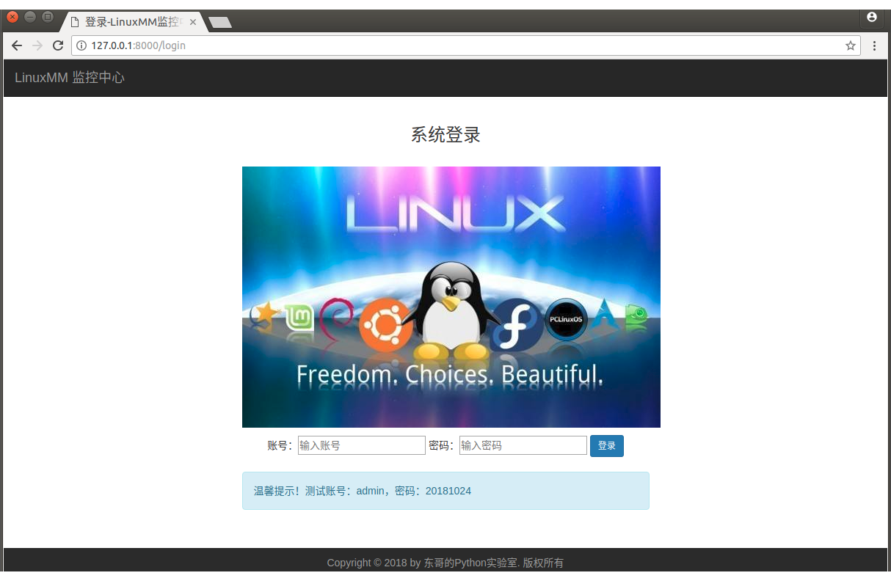

# 第13周作业说明

### 作业一

工程目录 **linuxmm**（Linux Monitor Mall）

```
$ django-admin startproject linuxmm
$ cd linuxmm/
$ python3 manage.py startapp monitor
```

运行 LinuxMM 项目前，请导入 linuxmm.sql 数据库文件！ 

【host】数据表结构

```
+-------+----------------------+------+-----+---------+----------------+
| Field | Type                 | Null | Key | Default | Extra          |
+-------+----------------------+------+-----+---------+----------------+
| id    | int(10) unsigned     | NO   | PRI | NULL    | auto_increment |
| tag   | varchar(32)          | NO   |     | NULL    |                |
| ip    | varchar(32)          | NO   |     | NULL    |                |
| cpu   | smallint(5) unsigned | YES  |     | NULL    |                |
| mem   | bigint(20) unsigned  | YES  |     | NULL    |                |
| disk  | bigint(20) unsigned  | YES  |     | NULL    |                |
| stat  | tinyint(3) unsigned  | YES  |     | 0       |                |
| cdate | datetime             | YES  |     | NULL    |                |
+-------+----------------------+------+-----+---------+----------------+
```

【user】数据表结构

```
+----------+------------------+------+-----+---------+----------------+
| Field    | Type             | Null | Key | Default | Extra          |
+----------+------------------+------+-----+---------+----------------+
| id       | int(10) unsigned | NO   | PRI | NULL    | auto_increment |
| username | varchar(32)      | NO   |     | NULL    |                |
| password | varchar(32)      | NO   |     | NULL    |                |
| email    | varchar(32)      | NO   |     | NULL    |                |
| cdate    | datetime         | YES  |     | NULL    |                |
+----------+------------------+------+-----+---------+----------------+
```

登录功能测试用户名为 admin，密码为 20181024


---

### 未完善功能

- 没有用户注册功能；
- 通过 paramiko 连接远程主机，每次查询都创建一次 ssh 连接，效率低，开销大；
- 只有点击查询进入详情页面，才会有远程数据更新操作，此页面更新数据暂时没有回写到数据库；
- 设置了 ssh 连接超时时间，网络不佳情况下可能会出错。


---

### 项目截图

#### 【登录页面】



#### 【首页】


#### 【详情页】


#### 【添加页面】


#### 【修改页面】


#### 【说明页面】


---

### 作业二

