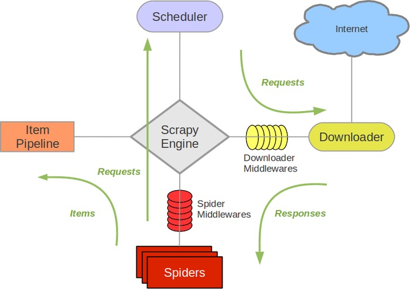

#  第9周：Python网络爬虫进阶实战（上）

让学员掌握 Scrapy 框架结构、运行原理、以及框架内部各个组件的使用。通过 Scrapy 框架的深入学习，让学员学会使用：

- Selector 选择器解析网页的信息
- 自定义 Spider 类爬取处理信息
- 使用 Downloader Middleware 和 Spider Middleware 中间件
- 能够定义使用 Item Pipeline 清理、验证和存储抓取数据

---

### 本周作业

#### 问题描述

本周课程主要讲解 Scrapy 框架的使用。具体包括 Scrapy 爬虫框架以及内部每个组件的使用（Selector 选择器、Spider 爬虫类、Downloader 和 Spider 中间件、ItemPipeline 管道类等）。

1. 使用 Scrapy 爬虫框架爬取新浪网的分类导航信息（网址 <http://news.sina.com.cn/guide/>）
2. 使用 Scrapy 模拟完成人人网登录的登录操作（网址 <http://www.renren.com/>）
3. 爬取当当图书网站中所有关于 “python” 关键字的图片信息（网址 <http://search.dangdang.com/?key=python&act=input>），要求将图书图片下载存储到指定目录，而图书信息写入到数据库中

#### 解题提示

1. 第一题可以参考 Selector 选择器中实战案例
2. 第二题可以参考爬虫基础的人人网登录，使用 Scrapy 的 POST 带参数请求
3. 第三题可以参考 ItemPipeline 中的实战案例

#### 批改标准

- Scrapy 新浪网的分类导航信息爬取（20分）
- Scrapy 模拟登录人人网（20分）
- 当当网的图片信息爬取（50分，其中，信息爬取20分、数据存储15分、图片下载15分）
- 其他项（10分）
  - 文件结构清晰
  - 代码整洁
  - 适量的注释

